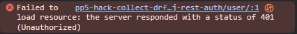

# **HACK COLLECT**: Hack your Life easier!

This is Hack Collect. A place for people to share their life hacks and make all of our days easier!

Link to the live website: [Link to Hack Collect](https://pp5-hack-collect-76d639ad2680.herokuapp.com/) 
Link to the website's project board: [Link to the Trello board](https://trello.com/b/Yi2LxF35/hack-collect)

## **TABLE OF CONTENTS**

[**USER EXPERIENCE**](#user-experience)
  * [Target audience](#target-audience)
  * [User's journey](#users-journey)
  * [Intuitive and consistent design](#intuitive-and-consistent-design)
    
 

[**AGILE PLANNING0**](#agile-planning)
  * [Epics](#epics)
  * [User Stories](#user-stories)

 

[**DATABASE**](#database)
  * [Database connection](#database-connection)

 

[**DESIGN**](#design)
  * [Color choice](#color-choice)
  * [Wireframes](#wireframes)
    
 

[**TECHNOLOGIES**](#technologies)
  * [HTML](#html)
  * [CSS](#css)
  * [JavaScript](#javascript)
  * [Python](#python)
  * [Django REST Framework](#django-rest-framework)
  * [Cloudinary](#cloudinary)
  * [Visual Studio Code](#visual-studio-code)
  * [GitHub](#github)
  * [Adobe Photoshop](#adobe-photoshop)
  * [Fontawesome](#fontawesome)
    
 

[**REUSABLE COMPONENTS**](#reusable-components)
  * [Dropdown Menu](#dropdown-menu)
  * [Asset](#asset)
  * [Avatar](#avatar)
  * [NavBar](#navbar)
  * [Footer](#footer)
  * [HackList](#hacklist)
  * [Comments](#comments)

 

[**TESTING**](#testing)
    
 

[**VALIDATOR TESTING**](#validator-testing)
  * [W3C CSS Validation](#w3c-css-validation)
  * [Flake8 validator](#flake8-validator)

 

[**USED PLATFORMS AND DEVICES**](#used-platforms-and-devices)
  * [Browsers](#browsers)
  * [Smartphones](#smartphones)

 

[**BUGS**](#bugs)
  * [Unfixed bugs](#unfixed-bugs)

 

[**ACCESSIBILTIY**](#accessibility)
  * [Lighthouse testing](#lighthouse-testing)
  * [Goal of accessibility measures](#goal-of-accessibility-measures)
    
 

[**DEPLOYMENT**](#deployment)
  * [GitHub](#github-1)
    * [Visual Studio Code connection](#visual-studio-code-connection)
    * [Commit and Push to GitHub](#commit-and-push-to-github)
  * [Heroku](#heroku)
    * [Create a new project](#create-a-new-project)
    * [Naming and region](#naming-and-region)
    * [Config Vars](#config-vars)
    * [GitHub connection](#github-connection)
    * [Deployment](#deployment-1)
    * [Successful deployment](#successful-deployment)
    
 

[**CREDITS**](#credits)
  * [Fontawesome](#fontawesome-1)
  * [Techsini](#techsini)
  * [HTML validator](#html-validator-1)
  * [CSS validator](#css-validator-1)
  * [JavaScript validator](#javascript-validator-1)
  * [Flake8 Extension](#flake8-extension)
  * [W3Schools](#w3schools)
  * [Favicon generator](#favicon-generator)
  * [YouTube](#youtube)
  * [Visual Studio Code](#visual-studio-code-1)

---

## **USER EXPERIENCE**

## Target audience
* The homepage's target audience are those who want to make their life easier by using normal household objects in a much more creative way. It is aimed towards people who want to do creative work. Those who like to tinker and bring more color into their life.

## User's journey
* The user is welcomed by the home page that displays a short summary of what they can expect. There, for logged-out users, a convenient sign-up button is placed in the hero area. If the user is already logged in, a button that takes them to the hack page is displayed instead to get them started immediately.
For easy access, a plus button is placed right next to the title link to add a hack. Once this site gets resized to mobile size, the button gets removed and placed in the navigation menu.

## Intuitive and consistent design
* A consistent layout was used throughout the homepage to ensure a coherent user experience. Every element is styled and placed for convenient access.

---

## AGILE PLANNING
* Here everyting related to the agile planning is displayed. This section contains the used epics and user stories, including their final results.

## Epics

### `EPIC: Authentication System`
* As a USER, I want to USE AN ACCOUNT LOGIN AND LOGOUT, so I can USE THE HOMEPAGE

To use login and logout features, an authentication system using dj-rest-auth was implemented.

*Login*

*Sign-up*

 

### `EPIC: Basic site structure`
* As a USER, I want to SEE A WELL STRUCTURED HOMEPAGE, so I can NAVIGATE WITHOUT PROBLEMS

The navigation bar was designed with three states in mind: logged-out, logged-in and for admin users. Based on these, the links in the navigation element change accordingly.

*Logged-out*

*Logged-in*

*Admin*

 

### `EPIC: HACKS`
* As a USER, I want to USE THE HACK LIST TO VIEW CONTENT, so I can VIEW AND ADJUST CONTENT

To use the basic functionality of the site and view life hacks, the hacks page was implemented. There, users can see other people's hacks and post their own. The list displays the first ten entries and loads more elements once the bottom is reached, using `InfiniteScroll`. 
The hacks can be displayed by their category or searched by their title or creator. All hacks are sorted starting with the newest entry on the top.

 

### `EPIC: Single Hack Page`
* As a USER, I want to SEE AND INTERACT WITH A HACK, so I can BE PART OF THE COMMUNITY

When clicking on a single hack or typing the URL into the browser, a page for a single hack is displayed. Here, detailed information like the full text, the rating system and comments get displayed. Comments get displayed in packs of ten each. After reaching the bottom, new ones get loaded via `InfiniteScroll`, provided more are present.

### `EPIC: Profile`
* As a USER, I want to VIEW AND USE PROFILES, so I can DISPLAY MY PERSONAL INFORMATIONS

To see only one person's hacks, display their statistics and follow or unfollow them, the profile page is used. Should the person visiting be the owner of the page, they can edit their avatar, biography, username or password.

 

### `EPIC: Followers`
* As a SITE USER, I want to FOLLOW PEOPLE, so I can VIEW THEIR CONTENT

People can follow other users to display their content on the `Followed` site. The content there is displayed in the same way hacks are organized to keep a consistent design across the site.

### `EPIC: Rated Content`
* As a USER, I want to RATE CONTENT AND VIEW ONLY RATED CONTENT, so I can CONTRIBUTE TO THE SITE

When a user is logged in, they can visit other people's hacks and leave a rating. This way, other people know what kind of quality to expect from a hack. People cannot rate their own hacks.

## Important User Stories

### HEADLINE
* DESCRIPTION

 

---

## **DATABASE**

## Database Connection
* A PostgreSQL database was used to store relevant pieces of information like profiles, hacks or ratings.

---

## **DESIGN**

## Color choice
* A dark design was chosen as it fits the need for users to prefer a dark theme rather than a light theme nowadays. Blue highlights were used to display a strong contrast.

 

## Wireframes

### Click to reveal list of wireframes

Click to see wireframes

### Mobile view

*HACKS PAGE*

* This layout was used as a base for the hack, followed and rated pages.

 

*LOGIN PAGE*

 

*SIGN-UP PAGE*

 

*PROFILE PAGE*

### Desktop view

*HACKS PAGE*

* This layout was used as a base for the hack, followed and rated pages.

 

*LOGIN PAGE*

 

*SIGN-UP PAGE*

 

*PROFILE PAGE*

---

## **TECHNOLOGIES**

### HTML / JSX
* HTML (HyperText Markup Language) and JSX (JavaScript Syntax Extensio) was used to create the structure of the homepage.

### CSS
* All styles were applied by using and linking a CSS (Cascading Style Sheet) file.

### JavaScript
* JavaScript was used to create the functionality of the homepage.

### Python
* Python was used as a programming language for editing backend code.

### Django REST Framework
* Django REST Framework was used as a to manage views, URLs, models and serializers.

### Cloudinary
* Cloudinary was used to store the image files uploaded by users.

### Visual Studio Code
* Visual Studio Code was used to clone the GitHub repository, edit the homepage's code and commit / push the results to GitHub. In addition, plugins were used to verify the code structure and best practices.

### GitHub
* GitHub was used to store the homepage's files, the user stories and epics.

### Adobe Photoshop
* Adobe Photoshop was used to create the wireframes.

### Fontawesome
* Fontawesome was linked in the homepage's code to include icon files.

---

## **REUSABLE COMPONENTS**

### Dropdown Menu
* The dropdown menu was used for editing and deleting a hack or a comment. In this component, the needed context gets sent to delete the corresponding content.

### Asset
* The asset component was used to display the loading spinners.

### Avatar
* The Avatar component was used to display either their profile picture, their username or both.

### NavBar
* The NavBar is seen across all sites to navigate through the homepage.

### Footer
* The footer is seen across all sites to display the end of the content and the copyright information

### HackList
* The HackList component can be used with filtering and queries to display content based on the preferences. 

### Comments
* The comments component can be used for comments posted to a specific page.

---

## **TESTING**

* All manual tests can be viewed in the testing file: **[Testing File](TESTING.md)**

---

## **VALIDATOR TESTING**

### W3C CSS Validation
* W3C CSS Validation was used to verfiy all CSS files. The results came out with no errors.

---

## **USED PLATFORMS AND DEVICES**

## Browsers
* Google Chrome
* Mozilla Firefox
* Microsoft Edge

## Smartphones
* Poco F5 Pro
* Samsung S21
* Samsung S23
* iPhone XS

## **BUGS**

## 401 authentication error
* An error occurs in the console displaying a 401 error when sending the authorization token. This is a known bug of Django Rest Framework and was not resolvable for me at the moment of completing the project. The site's functionality is not impacted by this.

## WebSocket connection error
* After some time, a WebSocket error occurs in the console, even though no WebSocket was used. The error has no impact on the site's functionality.

## findDOMNode error
* Even with strict mode turned off, an error regarding the usage of findDOMNode appears when clicking the NavBar component's toggle icon. This is due to an ending support in future versions to warn the development team. It has no impact on the site's functionality.

---

## **ACCESSIBILITY**

## Lighthouse testing
* All pages were checked using the Google Chrome's Lighthouse test. The results for performance and best practices were low in this scenario. The performance was impacted by big images that people upload and the overall massive library React provides. This could be resolved by converting the pictures in the future. 
The best practices received a low score because of the errors that appeared in Chrome's console. Those issues can be viewed in the bugs section.

### Mobile view

*HOME PAGE*

*HACKS PAGE*

*PROFILE PAGE*

### Desktop view

*HOME PAGE*

*HACKS PAGE*

*PROFILE PAGE*

## Goal of accessibility measures

* The goal of accessibility is the same result, performance and view of the content for any person, regardless of their condition. For example, the colors are chosen in a way that all people can use the site without any problems. The contrast needs to be high enough to read every text. 

---

## **DEPLOYMENT**

## GitHub

### Visual Studio Code connection
* To deploy the code to GitHub, I used Visual Studio Code to connect to my GitHub account.

**Important**: Due to the accidental login with my secondary account in the bash console, DominikW89 was used for all VS Code deployments. Once I noticed this, I did not want to change it to avoid confusion.

 

### Commit and Push to GitHub
* Once the change was made, I pushed the code to GitHub via the VS Code menu. A message needs to be entered for each deployment.

## Heroku

### Create a new project
* On the dashboard, select the menu to create a new Heroku project.

 

### Naming and region
* Give the app a proper name and select the region the application will be hosted in. For me, I chose Europe.

 

### Config Vars
* To keep your information private, head to the settings page and scroll down to config vars. Here, you can enter important and private information like the database url, the secret key and more.

 

### GitHub connection
* Once your config vars are setup, click on the deploy page. There, you need to connect your current GitHub project to your Heroku account. Enter the name and link it.

### Deployment
* When everything is connected successfully, click on deploy to deploy your selected GitHub branch.

 

### Successful deployment
* When everything worked correctly, a success message will be displayed and a link to the hosted app will appear.

---

## **CREDITS**

## [Fontawesome](https://fontawesome.com/)
* Used to implement website icons.

## [Techsini](https://techsini.com/multi-mockup/index.php)
* Used to create the mockup in the readme file.

## [HTML validator](https://validator.w3.org/)
* Used to verify HTML code.

## [CSS validator](https://jigsaw.w3.org/css-validator/)
* Used to verify CSS code.

## [JavaScript validator](https://jshint.com/)
* Used to verify JavaScript code.

## [Flake8 Extension](https://flake8.pycqa.org/en/latest/)
* Used to verify Python code.

## [react-simple-star-rating component](https://github.com/awran5/react-simple-star-rating)
* react-simple-star-rating component was used to build the rating component.

## [W3Schools](https://www.w3schools.com/)
* Used to lookup tips for the code.

## [Coolors](https://coolors.co/)
* Used to generate the color palette.

## [Favicon Generator](https://favicon.io/)
* Used to generate the favicon for the homepage.

## [YouTube](https://youtube.com)
* Videos for understanding some code areas.

## [Visual Studio Code](https://code.visualstudio.com/)
* Used to generate HTML boilerplate code and code editing.

## Special thanks
* A special thank you to my mentor Gareth McGirr who helped me along my journey and also to my best friend Frederic, who provided me with helpful insights and assisted me with many testing scenarios.