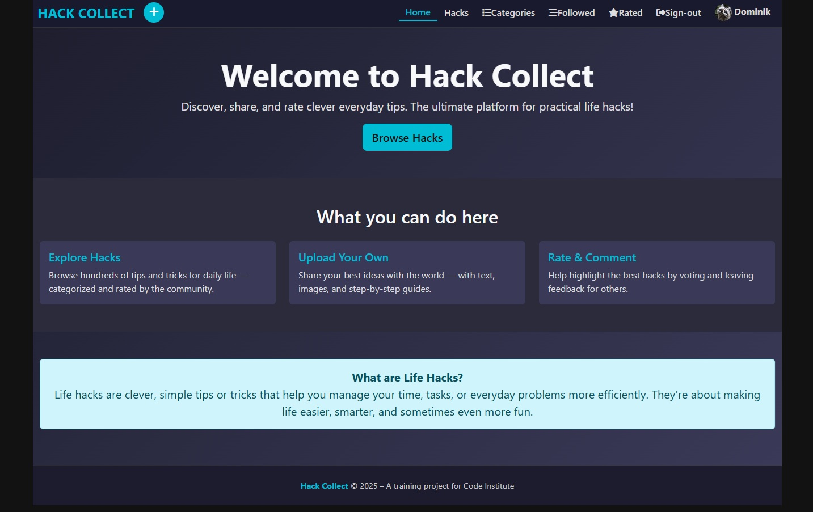
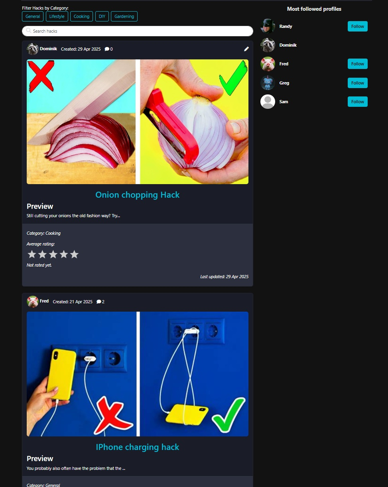
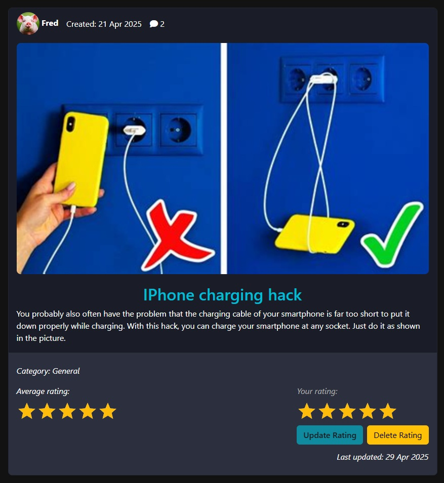
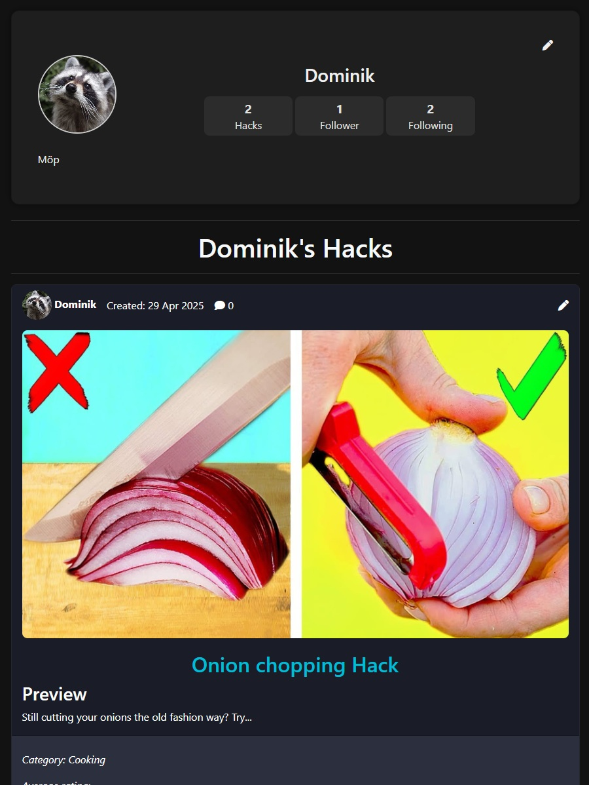
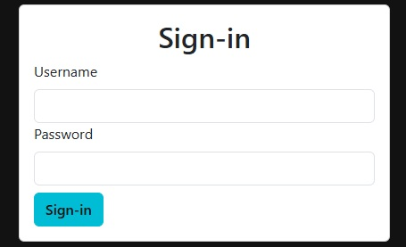
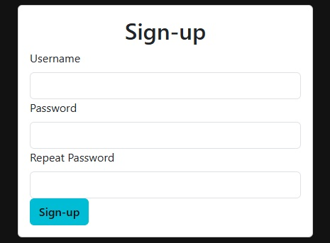
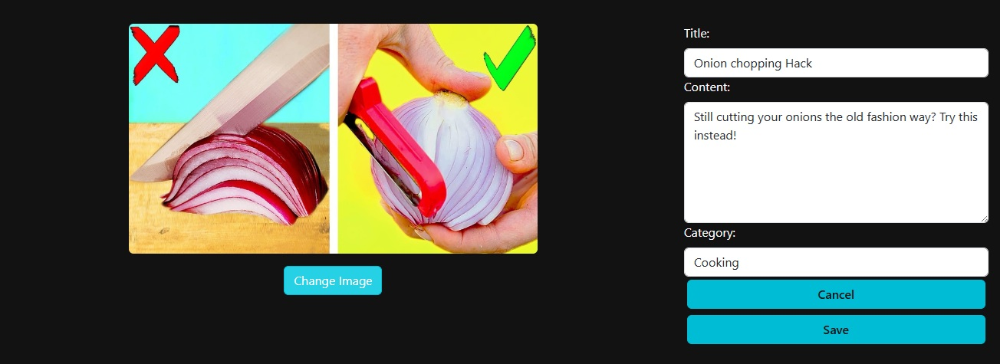
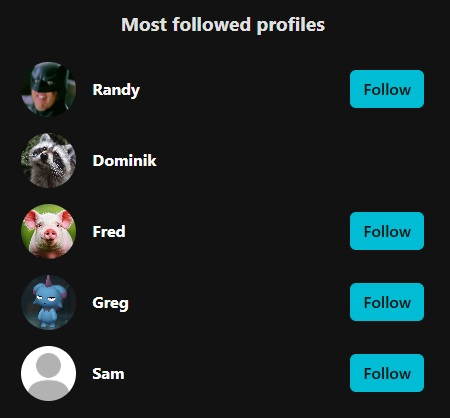
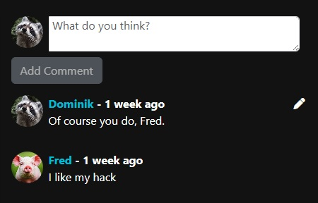
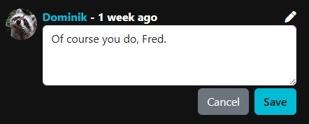

In this document, every manual test is written down to secure the functionality of the homepage.

# Table of Contents
1. [**Homepage**](#homepage)
2. [**NavBar**](#navbar)
3. [**Hack List**](#hack-list)
4. [**Hack Page**](#hack-page)
5. [**Profiles**](#profiles)
6. [**Sign-in**](#sign-in)
7. [**Sign-up**](#sign-up)
8. [**Hack Editing**](#hack-editing)
9. [**Popular Profiles**](#popular-profiles)
10. [**Comments**](#comments)
10. [**Comment Editing**](#comment-editing)
10. [**Rating a Hack**](#rating-a-hack)

# Homepage

| Action taken | Expected result | Result |
|--------------|-----------------|--------|
| Visit HomePage as a logged-out user | "Sign Up Now" button is shown and links to "/signup" | Pass |
| Visit HomePage as a logged-in user | "Browse Hacks" button is shown and links to "/hacks" | Pass |
| Check presence of main heading | Heading "Welcome to Hack Collect" is visible | Pass |
| Check presence of subtext | Subtext explains purpose of the platform | Pass |
| Click on "Sign Up Now" button (logged out) | Navigates to "/signup" | Pass |
| Click on "Browse Hacks" button (logged in) | Navigates to "/hacks" | Pass |
| Scroll to "What you can do here" section | Section with three cards is visible | Pass |
| Verify first card title and description | Card titled "Explore Hacks" with appropriate text is displayed | Pass |
| Verify second card title and description | Card titled "Upload Your Own" with appropriate text is displayed | Pass |
| Verify third card title and description | Card titled "Rate & Comment" with appropriate text is displayed | Pass |
| Confirm Info Alert is visible at the bottom | Alert with explanation of life hacks is shown | Pass |
| Verify responsive layout on mobile width | Cards stack vertically and layout adapts correctly | Pass |
| Confirm correct CSS classes are applied | Elements include custom styles from HomePage.module.css | Pass |
| Confirm all Bootstrap components render correctly | Layout uses Container, Row, Col, Card, Button, and Alert components properly | Pass |

---

# NavBar

| Action taken | Expected result | Result |
|--------------|-----------------|--------|
| Visit site as a logged-out user | "Sign-in" and "Sign-up" links are visible | Pass |
| Visit site as a logged-in user | "Followed", "Rated", "Sign-out", and avatar links are visible | Pass |
| Visit site as an admin user | "Categories" link is visible alongside other logged-in links | Pass |
| Click on site title "Hack Collect" | Navigates to "/" | Pass |
| Click "Hacks" in navigation | Navigates to "/hacks" | Pass |
| Click "Sign-in" when logged out | Navigates to "/sign-in" | Pass |
| Click "Sign-up" when logged out | Navigates to "/sign-up" | Pass |
| Click "Followed" when logged in | Navigates to "/followed" | Pass |
| Click "Rated" when logged in | Navigates to "/rated" | Pass |
| Click avatar when logged in | Navigates to "/profiles/[user-profile-id]" | Pass |
| Click "Sign-out" when logged in | Opens confirmation modal | Pass |
| Click "Cancel" in confirmation modal | Modal closes without signing out | Pass |
| Click "Sign out" in confirmation modal | User is signed out and redirected to "/" | Pass |
| As admin, click "Categories" | Navigates to "/category-manager" | Pass |
| Navbar toggle clicked on mobile | Navbar expands/collapses as expected | Pass |
| Add Hack button is visible in desktop view when logged in | Plus icon button is visible and navigates to "/add-hack" | Pass |
| Add Hack link is visible in collapsed mobile menu when logged in | Add Hack nav item visible and clickable in menu; navigates to "/add-hack" | Pass |
| Clicking link or outside of NavBar Toggle | Navbar collapses automatically | Pass |
| Navbar uses custom styles from NavBar.module.css | Custom styles are applied to nav elements and buttons | Pass |
| Navigation links highlight correctly when active | Active link has class from `styles.Active` | Pass |

---

# Hack List

| Action taken | Expected result | Result |
|--------------|-----------------|--------|
| Page loads with no user interaction | Spinner is shown briefly, then hacks list or "No results found" appears | Pass |
| Categories are fetched successfully | Category buttons are displayed | Pass |
| Click on a category button | Hacks are filtered by selected category | Pass |
| Click again on active category button | Category filter is cleared, all hacks are shown again | Pass |
| Enter text in the search input | Hacks list is filtered based on the search term | Pass |
| Clear the search input | Full hacks list is reloaded | Pass |
| Search for a non-existing hack | "No results found." message is displayed | Pass |
| Scroll down with multiple hacks | Additional hacks are loaded via InfiniteScroll | Pass |
| Submit the search form (press Enter) | Nothing happens, page does not reload (preventDefault works) | Pass |
| Open page on mobile device (small screen) | PopularProfiles component is displayed above the list | Pass |
| Open page on desktop (large screen) | PopularProfiles component is displayed in a separate right column | Pass |
| Navigate to `/rated` route | Hacks are filtered to only show hacks rated by the current profile | Pass |
| Navigate to `/followed` route | Hacks are filtered to only show hacks of followed owners | Pass |
| Navigate to different route and back (changes pathname) | Hacks list reloads based on new pathname and filters | Pass |
| API call for hacks fails (simulate error) | Spinner disappears, but no hacks are shown; page does not crash | Pass |
| Typing quickly in search bar | Fetches are delayed (debounced) to avoid excessive API requests | Pass |
| Fast typing and pressing Enter multiple times | No page reload, input is handled correctly | Pass |

---

# Hack Page

| Action taken | Expected result | Result |
|--------------|-----------------|--------|
| Load the HackPage component with valid `id` parameter in the URL. | The hack data is fetched, and the page displays the hack information. | Pass |
| Load the HackPage component with an invalid `id` parameter. | The page should show "No hack found!". | Pass |
| Load the HackPage component with a valid `id` and a user logged in. | The user should see the option to add a comment. | Pass |
| Load the HackPage component with no comments for the specific hack. | The page should display "No comments found." | Pass |
| Load the HackPage component with comments for the specific hack. | The comments should be displayed with Infinite Scroll functionality. | Pass |
| Load the HackPage component as a logged in user | A form to create a new comment should appear. | Pass |
| Scroll through the comments when there are more comments available. | New comments should be loaded and displayed via Infinite Scroll. | Pass |
| Load the HackPage component with a user logged in | The profile image should be visible next to the comment creation form. | Pass |
| Load the HackPage component and check for loading spinner when data is being fetched. | A loading spinner should be shown while fetching the hack and comment data. | Pass |
| Submit a new comment when logged in. | The new comment should appear immediately after submission. | Pass |

---

# Profiles

| Action taken | Expected result | Result |
|--------------|-----------------|--------|
| Click on "Follow" button in Profile component | Profile is followed and "Follow" button changes to "Unfollow" | Pass |
| Click on "Unfollow" button in Profile component | Profile is unfollowed and "Unfollow" button changes to "Follow" | Pass |
| View Profile component on mobile | Profile is displayed in compact mobile layout | Pass |
| View Profile component on desktop | Profile is displayed with full username and follow/unfollow button | Pass |
| Open ProfileEditForm as profile owner | Current profile data is loaded into the form fields | Pass |
| Edit bio in ProfileEditForm and save | Updated bio is saved and user is redirected back | Pass |
| Edit username with less than 15 characters | Username should update | Pass |
| Edit username with more than 15 characters | Username should not update and a message regarding too many characters should appear | Pass |
| Upload new profile image in ProfileEditForm and save | New profile image is uploaded and displayed | Pass |
| Click "Cancel" button in ProfileEditForm | User is redirected back without saving changes | Pass |
| Attempt to open ProfileEditForm for another user | User is redirected to homepage | Pass |
| View ProfilePage with existing hacks | Profile details and list of hacks are displayed | Pass |
| View ProfilePage with no hacks | Message is shown that no hacks are posted | Pass |
| Click "Follow" button on ProfilePage | Profile is followed and button changes to "Unfollow" | Pass |
| Click "Unfollow" button on ProfilePage | Profile is unfollowed and button changes to "Follow" | Pass |
| Open UsernameForm as profile owner | Current username is prefilled in input field | Pass |
| Change username in UsernameForm and save | Username is updated and user is redirected back | Pass |
| Submit empty username in UsernameForm | Validation error message is displayed | Pass |
| Click "Cancel" button in UsernameForm | User is redirected back without changes | Pass |
| Attempt to open UsernameForm for another user | User is redirected to homepage | Pass |
| Open UserPasswordForm as profile owner | Password change form is displayed | Pass |
| Enter matching new passwords in UserPasswordForm and submit | Password is updated and user is redirected back | Pass |
| Enter non-matching passwords in UserPasswordForm and submit | Validation error message is displayed | Pass |
| Click "Cancel" button in UserPasswordForm | User is redirected back without changes | Pass |
| Attempt to open UserPasswordForm for another user | User is redirected to homepage | Pass |

---

# Sign-in

| Action taken | Expected result | Result |
|--------------|-----------------|--------|
| Enter valid username and password, click "Sign-in" | User is redirected to homepage | Pass |
| Enter invalid username or password, click "Sign-in" | Error message is displayed | Pass |
| Submit empty form on "Sign-in" page | Error messages for required fields are displayed | Pass |
| Enter valid username, leave password empty, click "Sign-in" | Error message for missing password is displayed | Pass |
| Enter valid password, leave username empty, click "Sign-in" | Error message for missing username is displayed | Pass |
| Try to sign in while already signed in (via useRedirect) | User is redirected to homepage immediately | Pass |
| Refresh page after successful "Sign-in" | User stays logged in on homepage (if session persists) | Pass |
| Navigate away from "Sign-in" page while form is filled, then return | Form is reset to empty fields | Pass |

---

# Sign-up

| Action taken | Expected result | Result |
|--------------|-----------------|--------|
| Enter valid username, matching valid passwords, click "Sign-up" | User is redirected to "Sign-in" page | Pass |
| Enter username that already exists, click "Sign-up" | Error message about existing username is displayed | Pass |
| Enter valid username and mismatched passwords in "Sign-up" form, click "Sign-up" | Error message about password mismatch is displayed | Pass |
| Submit empty "Sign-up" form | Error messages for all required fields are displayed | Pass |
| Enter only username in "Sign-up" form, leave passwords empty, click "Sign-up" | Error messages for missing passwords are displayed | Pass |
| Enter password1 but no password2 in "Sign-up" form | Error message for missing repeated password is displayed | Pass |
| Enter password2 but no password1 in "Sign-up" form | Error message for missing password is displayed | Pass |
| Attempt to submit a short password in "Sign-up" form | Error message about password strength is displayed | Pass |
| Enter special characters in username field in "Sign-up" form | Error message about invalid username (if API validation fails) is displayed | Pass |
| Try to sign up while already signed in (via useRedirect) | User is redirected to homepage immediately | Pass |
| Navigate away from "Sign-up" page while form is filled, then return | Form is reset to empty fields | Pass |

---

# Hack Editing

| Action taken | Expected result | Result |
|--------------|-----------------|--------|
| Load the HackEdit page | Form loads with existing hack data populated | Pass |
| Attempt to edit a hack not owned by current user | User is redirected to home page | Pass |
| Change the title text input | Title field updates correctly | Pass |
| Change the content text area | Content field updates correctly | Pass |
| Select a different category from the dropdown | Category selection updates correctly | Pass |
| Upload a new valid image file | New image preview is shown immediately | Pass |
| Upload an invalid file type as image | Appropriate error message is displayed | Pass |
| Click the "Cancel" button | User is navigated back to previous page | Pass |
| Click the "Save" button with all valid fields | Changes are saved and user is redirected to the hack detail page | Pass |
| Submit form with missing required title | Warning alert is shown under the title field | Pass |
| Submit form with missing required content | Warning alert is shown under the content field | Pass |
| Submit form with too large or invalid image | Warning alert is shown under the image section | Pass |
| Click "Change Image" button and select new image | File input opens and allows file selection | Pass |
| Mobile view: form fields display correctly below the image | Layout adapts properly for smaller screens | Pass |
| Desktop view: form fields display on right side of image | Layout adapts properly for larger screens | Pass |
| Press the browser "Back" button after editing | Browser navigates back without saving changes | Pass |
| Try to submit without changing anything | Form submits and redirects without errors | Pass |

---

# Popular Profiles

| Action taken | Expected result | Result |
|--------------|-----------------|--------|
| Load component with non-empty `popularProfiles.results` on desktop view | "Most followed profiles" title is displayed, all profiles are listed vertically | Pass |
| Load component with non-empty `popularProfiles.results` on mobile view | "Most followed profiles" title is displayed, first 4 profiles are listed horizontally | Pass |
| Verify that each profile has a unique `key` prop set to `profile.id` | No React warning about missing keys appears | Pass |
| Resize window to simulate switching between desktop and mobile | Layout adapts correctly between vertical and horizontal display | Pass |
| Test with exactly 4 profiles in `popularProfiles.results` on mobile view | All 4 profiles are displayed, no missing or extra profiles | Pass |
| Test with fewer than 4 profiles in `popularProfiles.results` on mobile view | Only available profiles are displayed, no errors | Pass |
| Test with more than 4 profiles in `popularProfiles.results` on mobile view | Only first 4 profiles are displayed | Pass |
| Check that "Most followed profiles" title uses correct CSS class (`styles.title`) | Title is styled appropriately according to `PopularProfiles.module.css` | Pass |
| Check spinner appearance while `popularProfiles` is loading or empty | Spinner is centered and visible | Pass |
| Test that profile components receive correct props | Each Profile component receives the correct `profile` object and `mobile` prop if applicable | Pass |
| Verify responsive design on different screen sizes | Profiles layout and title remain visually consistent | Pass |

---

# Comments

| Action taken | Expected result | Result |
|--------------|-----------------|--------|
| Open HackPage with existing comments | Existing comments are displayed | Pass |
| Open HackPage with no comments | "No comments found. Do you want to start?" is displayed | Pass |
| Type a valid comment into the input field | Comment text appears in the textarea | Pass |
| Submit a non-empty comment | New comment is added to the top of the comment list | Pass |
| Submit an empty comment | Submit button is disabled | Pass |
| Submit a comment that exceeds server validation limits | Validation warning is displayed | Pass |
| See own comment | Edit and delete dropdown appears next to the comment | Pass |
| See comment from another user | No edit/delete dropdown appears | Pass |
| Click on user avatar | Redirects to the user's profile page | Pass |
| Click on username | Redirects to the user's profile page | Pass |

---

# Comment Editing

| Action taken | Expected result | Result |
|--------------|-----------------|--------|
| Click "Edit" on own comment | CommentEditForm is displayed with current content prefilled | Pass |
| Edit the content and click "Save" | Updated comment content is displayed and form closes | Pass |
| Edit the content and click "Cancel" | Edit form closes without saving changes | Pass |
| Successfully edit comment | Updated timestamp is refreshed | Pass |
| Submit empty edit form | Validation warning is displayed | Pass |
| Edit comment, experience unexpected server error | "An unexpected error occurred." message is displayed | Pass |

---

# Rating a Hack

| Action taken | Expected result | Result |
|--------------|-----------------|--------|
| Load the component with a new hack and an unauthenticated user. | No rating data should be displayed, and the component should not be visible | Pass |
| Click on a star rating (e.g., 4 stars) as a logged-in user | The rating should be updated to 4 stars and the "Submit Rating" button should be enabled. | Pass |
| Submit a rating as a user who has not rated before. | A new rating should be submitted, and the button text should change to "Update Rating". The average rating should change. | Pass |
| Submit a rating after modifying the rating. | The existing rating should be updated with the new value, and the button text should change to "Update Rating". | Pass |
| Submit a rating with no change (same as the current rating). | The "Submit Rating" button should be disabled. | Pass |
| Try to submit a rating with the value set to 0. | The "Submit Rating" button should be disabled. | Pass |
| Click the "Delete Rating" button after a rating has been submitted. | The rating should be removed, and the "Submit Rating" button should be re-enabled. | Pass |
| Load the component with an existing rating from a user. | The average rating should be displayed | Pass |
| Click "Delete Rating" when no rating exists. | The "Delete Rating" button should be disabled. | Pass |
| Delete a rating and check if it disappears from the UI. | The rating should be removed from the UI, and the user should be able to submit a new rating. | Pass |

